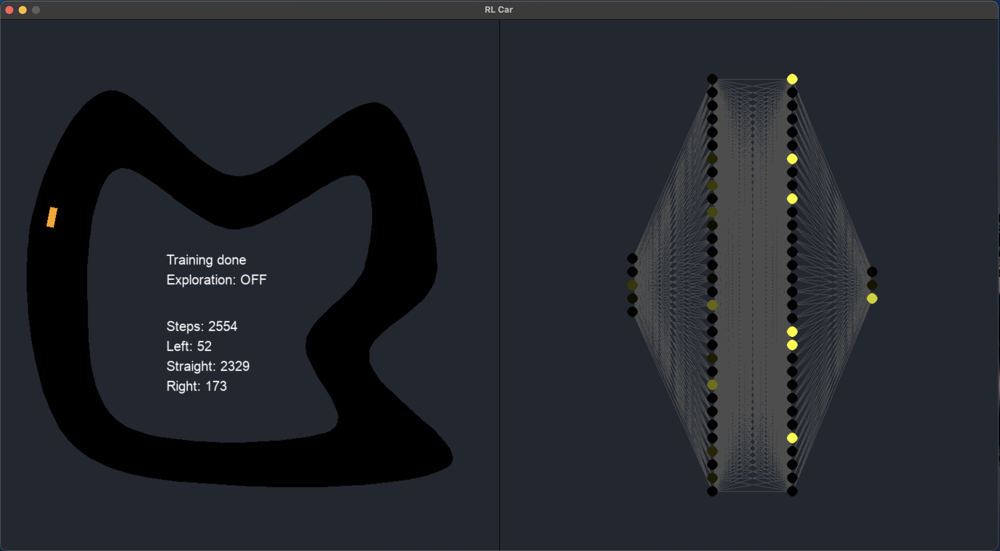

# Reinforcement Learning with Deep Q-Networks
Using the power of DQNs, this 2D car learns to drive and follow the track without crashing.
Implemented with 2 neural networks: a **Policy** one (which we train) and a **Target** one (used for stable updates), which are synced every X training steps. The training is done using samples from the Experience Replay memory, which prevents overfitting and allows the network to better generalize.


Updates are done using the classic Bellman equation: Q(s,a) = r + gamma * max(Q(S',a')).


Neural networks created with PyTorch and GUI with PyGame.

### Screenshot (neural network animation included!)


### Running the app
```
uv run dqn.py
```